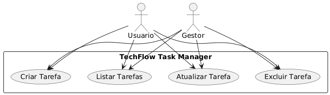
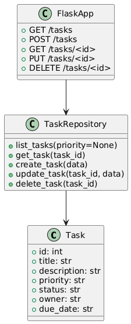

# TechFlow Task Manager

## Objetivo
Sistema web básico para gerenciamento de tarefas com foco em metodologias ágeis: acompanhar fluxo de trabalho, priorizar tarefas críticas e monitorar desempenho da equipe.

## Escopo inicial
- CRUD de tarefas (Create, Read, Update, Delete)
- Campos: título, descrição, prioridade, status (To Do, In Progress, Done), responsável
- API REST + interface mínima (opcional)

## Mudança de escopo
Durante o desenvolvimento foi incluído o campo **due_date** (data de entrega) para permitir melhor acompanhamento de prazos e planejamento das tarefas.

## Metodologia adotada
- Kanban no GitHub Projects (colunas: A Fazer, Em Progresso, Concluído)
- Sprints curtos (1 semana) para cadência de commits e entregas
- Pull Requests com revisão simples

## Arquitetura
- Backend: Flask (Python)
- Testes: Pytest
- CI/CD: GitHub Actions (execução automática dos testes a cada push)

## Como executar (local)
1. Clone o repositório:
   ```bash
   git clone https://github.com/Dieggo775/techflow-task-manager.git
   cd techflow-task-manager

## Diagramas UML


